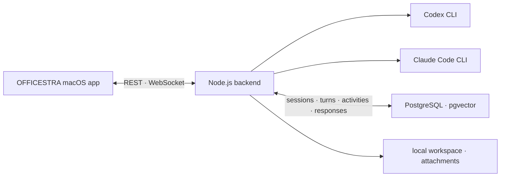

# OFFICESTRA

[한국어](README.md) | **English**

> A local-first macOS workspace that turns Codex CLI and Claude Code into a five-person AI team.

<p align="center">
  
  
  
  
  <a href="https://github.com/neosp8888-design/office/releases/tag/v1.3.3"></a>
</p>

OFFICESTRA replaces a collection of separate terminal sessions with one interactive office. Select an AI coworker, assign a task, and watch their user-visible progress and final response in real time. Every coworker has an independent role, CLI provider, model, reasoning effort, speed tier, permission level, and persistent conversation session. The backend keeps work running even when the app window is closed.

<p align="center">
  
</p>
<p align="center"><sub>The complete OFFICESTRA workspace.</sub></p>

## Core experience

- Assign work directly or ask any coworker to delegate through the local API, monitor the other coworkers, and synthesize their results.
- Choose Codex or Claude Code, a model, Fast or Standard mode, reasoning effort, and file permissions per coworker.
- Queue up to three follow-up tasks for a busy coworker, reorder them, or apply one immediately.
- See `Thinking` immediately, followed by user-visible messages, reasoning summaries, commands, tools, and file changes in their actual order.
- Copy individual Codex messages and inspect file-change results where they occurred.
- Restore persisted PostgreSQL state and provider-native CLI sessions after relaunching the app.
- Attach up to 20 files and view image thumbnails, generated images, and Markdown output.
- Search per-coworker history and the complete archive by task, response, model, session ID, reasoning effort, and speed tier.
- Inspect each provider session's actual context remaining, set a per-coworker automatic compaction threshold, or compact immediately. Start, completion, and failure appear live in speech bubbles and status icons.
- Run Claude Code's suggested follow-up questions directly and rate completed responses with like or dislike feedback.
- Do not append past work records through automatic RAG retrieval; query them only when needed, and promote durable decisions, constraints, and incident lessons to the Internal Wiki only after user approval.
- Switch between 2D and 3D offices and day or night themes while characters and speech bubbles reflect live work state.

## Workspace map

| Area | Purpose |
| --- | --- |
| Live office | Select five coworkers, inspect status, and switch between 2D, 3D, day, and night scenes |
| Coworker monitors | Open the selected coworker's conversations and provider session history |
| Archive cabinet | Search and inspect work from every coworker |
| Whiteboard | View Codex and Claude account quotas, today's and 30-day API cost estimates, and CLI updates |
| Internal Wiki (`사내 위키`) | Search approved durable knowledge and approve or reject coworker proposals |
| Live workspace | Follow progress events and final responses in chronological order |
| Command bar | Select coworkers, provider, model, speed, reasoning, permissions, attachments, and run or stop tasks |

The office scene is not decorative. Characters, monitors, the archive cabinet, and the whiteboard are interactive entry points into selection, history, and usage views.

## Features

### Coworkers and CLI providers

- Custom names, roles, and task instructions for every coworker.
- Independent Codex CLI or Claude Code selection per coworker.
- Model, Fast or Standard mode, reasoning effort, and read/write permission controls.
- Separate persistence of selected settings and the settings actually used for each turn.
- Provider-native session IDs for follow-up work.
- Claude Code reuses one persistent process for the same settings, session, and workspace; Codex resumes its existing thread.
- Model, speed, effort, permission, and role changes within the same provider keep the current session; switching between Codex and Claude starts a new one.
- In-session replies when an agent needs a user decision.
- Protection against concurrent tasks for the same coworker, with cancellation for active work.
- Actual context limits and remaining tokens, 50–95% automatic compaction thresholds, and manual compaction per coworker.
- WebSocket-synchronized automatic and manual compaction progress, completion, and failure, including active-state restoration after reconnecting.
- Separate visual states for quota exhaustion and ordinary execution failures.

### Live work

- A Node.js backend owns CLI child processes and their lifecycle.
- Tasks, responses, and user-visible progress events are written to PostgreSQL before the UI is notified.
- REST snapshots and WebSocket change notifications support reconnecting without losing work.
- Optimistic task cards display an animated `Thinking` state immediately after submission.
- A busy coworker can hold up to three queued follow-up tasks with cancel, reorder, and apply-now actions.
- Progress explanations, reasoning summaries, messages, commands, and tools retain database event order, while only adjacent operations are grouped.
- A single activity row moves from running to completed or failed instead of producing duplicate entries.
- Every user-visible message has its own copy action, and the final conclusion remains visually distinct.
- Provider-supplied follow-up suggestions can be submitted as the next task, and completed responses retain like or dislike feedback.
- Codex file-change cards update in place with status, paths, and available addition/deletion counts.
- Claude Code timelines distinguish tool badges, shell commands, file edits, task lists, and collapsible thinking blocks.
- Reasoning, command, and tool groups start collapsed and can be expanded on demand.
- The feed follows the latest output until the user scrolls upward, then offers an explicit jump-to-latest control.
- History begins with 10 turns and loads 10 more at the top while preserving the current reading position, up to a 30-turn live window.
- Running and recently completed tasks stay visible even when they fall outside the normal window.
- Older records remain available through coworker monitors and the complete archive.
- Claude streaming output, Codex completed messages, and GitHub Flavored Markdown share one presentation layer.
- Code blocks, tables, headings, lists, links, and local generated-image previews are supported.
- Each task accepts up to 20 attachments with thumbnails and Finder integration.

### History, Internal Wiki, and usage

- Search across coworker name, task, response, session ID, model, reasoning effort, and Fast or Standard mode.
- Preserve the provider, model, effort, speed tier, and external session ID used by every turn.
- Show the execution mode consistently in live cards, coworker history, and the complete archive.
- Display Codex and Claude 5-hour and 7-day quotas fetched directly from provider accounts, with account-plan labels.
- Display today's and trailing 30-day API cost estimates recorded by this OFFICESTRA instance.
- Check installed Codex and Claude CLI versions and apply updates only to the selected provider.
- Store completed work as source-of-truth records in PostgreSQL `work_records` and synchronize searchable records into derived `rag_documents`.
- Do not inject separately retrieved past work records into new prompts automatically. When prior context is needed, coworkers explicitly query `GET /api/work-records` or `POST /api/rag/search`; continuity within the same provider-native CLI session is preserved.
- Let coworkers propose durable decisions, constraints, and significant incident lessons, while the user approves or rejects them under **Pending Review (`확인 대기`)** in the Internal Wiki.
- Publish and search only approved proposals under **Current Knowledge (`현재 지식`)**, with links to the source work records that support them.
- Show RAG, database, file, web, tool, and skill evidence actually used by a response, with clickable web links and Finder actions for files.

## Architecture



1. The app submits a coworker and task to `POST /api/agent-jobs`.
2. The UI renders an optimistic turn while the backend launches the selected CLI in the shared configured workspace. Different coworkers can run concurrently.
3. The returned `turnId` reconciles the optimistic card with the persisted record.
4. Sequenced progress activities and response drafts are stored in PostgreSQL first.
5. `/ws` announces a change, and the app fetches the latest turn state from `GET /api/live-feed/:turnId`.
6. The final result appears when the turn reaches `completed`, `failed`, or `interrupted`.

As long as the backend remains running, tasks continue after the app window closes. On relaunch, the app loads persisted snapshots and reconnects to WebSocket updates.

## Run coworkers from Slack

Slack Socket Mode lets you run all five coworkers from mobile Slack without
exposing port 4317. Use `/office` to select a default coworker, then send the bot
a direct message or mention it in a channel to start that coworker's CLI task.

- Coworker names and selection buttons come from the current PostgreSQL settings.
- Each Slack thread keeps its OFFICESTRA conversation ID for follow-up messages.
- One status message is updated with live activity, and final replies stay in the thread.
- Tasks that need input continue in the same coworker session when you reply in the thread.
- Only explicitly allowed Slack user IDs may start CLI tasks.

To configure the integration.

1. Import `integrations/slack/manifest.yaml` when creating the Slack app.
2. Install the app to obtain its `xoxb-` Bot Token.
3. Create an App Token with `connections:write` and copy its `xapp-` value.
4. Copy the values described by `integrations/slack/slack.env.example` into
   `~/.officestra/slack.env`, then set that file's permissions to `600`.
5. Restart the backend and confirm that its log reports
   `OFFICESTRA Slack Socket Mode 연결 완료`.

The token file stays outside the repository and must not be committed. If the
tokens are absent, only the Slack integration is disabled; the macOS app and
existing backend continue to work normally.

## Shared workspace and Git operation

Every new task uses the configured `workdir`. If it is a Git repository,
OFFICESTRA does not create a separate branch or worktree; coworkers operate on
the currently selected branch, usually `main`.

Different coworkers can run concurrently in the same folder. Each one sees the
current files and uncommitted changes, so edits to unrelated files accumulate in
one working tree. Concurrent edits to the same file or line can overwrite each
other. Every coding task should inspect `git status` and `git diff` before editing
or committing. Restarting the backend closes running or preparing turns as
`interrupted`; they are not replayed automatically.

The OFFICESTRA backend does not automatically commit, merge, rebase, or push.
A task may be explicitly instructed to edit, test, and commit. Include push only
when remote publication is intended. Review all accumulated changes and resolve
overlapping edits or conflicts before committing.

OFFICESTRA does not lock files against other coworkers, terminals, or IDEs. Git
state remains the source of truth for identifying and reconciling concurrent
changes.

## Installation

OFFICESTRA supports Apple silicon (M1 or later) and macOS 14 or later. Intel
Macs are not supported. The latest public build is the **v1.3.3 Community
Preview**. Its DMG includes the Apple silicon app, Node.js, and the local
backend. Users still provide Docker Desktop and an authenticated Codex CLI or
Claude Code CLI. `main` may contain changes pushed after the latest release.

Available models still depend on the installed CLI version and account
entitlements.

### Easiest path

1. Open the [OFFICESTRA v1.3.3 release](https://github.com/neosp8888-design/office/releases/tag/v1.3.3)
   and download `OFFICESTRA-v1.3.3-macOS-arm64.dmg`.
2. Open the DMG and drag `OFFICESTRA.app` into **Applications**.
3. For the first launch, Control-click the app and choose **Open**. The public
   build is ad hoc signed and not Apple-notarized, so macOS may block an
   ordinary double-click.
4. Use the first-run assistant to verify Docker and CLI availability and select
   the project folder shared by all coworkers.

The release page publishes version `1.3.3` (build 6), the arm64 architecture,
and the DMG SHA-256. Developers who want the current `main` should use the
source workflow below.

<details>
<summary><strong>Show developer commands for running the current main from source</strong></summary>

### Manual setup on a new Mac

Paste each command block into **Terminal**, found under
`Applications → Utilities → Terminal`.

#### 1. Install Apple's developer tools

```sh
xcode-select --install
```

Choose **Install** in the dialog and accept the license. Reopen Terminal when it
finishes, then verify both tools.

```sh
git --version
swift --version
```

If Swift is older than 5.10, run macOS Software Update first. If it is still too
old, install the latest Xcode from the App Store.

#### 2. Install Homebrew and Node.js

Run the installer from the [official Homebrew site](https://brew.sh/).

```sh
/bin/bash -c "$(curl -fsSL https://raw.githubusercontent.com/Homebrew/install/HEAD/install.sh)"
```

If the installer prints `Next steps`, run the two lines it shows. Open a new
Terminal window, confirm `brew --version`, and install Node.js.

```sh
brew install node
node --version
npm --version
```

#### 3. Install Docker Desktop

```sh
brew install --cask docker
open -a Docker
```

Accept the first-run terms, choose **Use recommended settings**, and wait until
the whale menu icon reports that Docker is ready.

```sh
docker compose version
docker info
```

You can instead follow [Docker's official Mac installer](https://docs.docker.com/desktop/setup/install/mac-install/)
and choose the Apple silicon download.

#### 4. Verify an AI CLI

Do not reinstall a CLI you already use.

```sh
codex --version
claude --version
```

If neither exists, install and authenticate the one you want. Codex opens a
browser for ChatGPT sign-in. Claude Code presents its account choices the first
time you run `claude`.

```sh
# If you use Codex
npm install -g @openai/codex
codex login

# If you use Claude Code
npm install -g @anthropic-ai/claude-code
claude
```

See the official [Codex CLI setup](https://help.openai.com/en/articles/11096431)
and [Claude Code setup](https://docs.anthropic.com/en/docs/claude-code/getting-started)
for current provider-specific details.

#### 5. Download and configure OFFICESTRA

Run the clone command only when `~/OFFICESTRA` does not already exist. If it
does exist, do not delete or overwrite it; ask Codex or Claude to inspect the
existing installation first. This command downloads the latest default branch.

```sh
git clone --depth 1 \
  https://github.com/neosp8888-design/office.git \
  "$HOME/OFFICESTRA"
cd "$HOME/OFFICESTRA"
git rev-parse HEAD
```

Create a workspace for your AI coworkers and replace the public placeholder.

```sh
mkdir -p "$HOME/Projects"
sed -i '' "s#/Users/your-name/Projects#$HOME/Projects#" Sources/OfficeCore/Resources/characters.json
grep '"workdir"' Sources/OfficeCore/Resources/characters.json
```

Use another absolute path instead of `$HOME/Projects` if preferred. Every
coworker uses the current files and changes in that shared folder.

#### 6. Start the backend and app

Keep the first Terminal window open while the backend runs.

```sh
cd "$HOME/OFFICESTRA"
./scripts/start-backend.sh
```

The first run downloads the PostgreSQL image and Node packages, so it can take a
while. The startup script waits for PostgreSQL, then runs the database migrations
and backend. It is ready when the health response includes `"ok":true` and
`"service":"officestra-backend"`.

```sh
curl -fsS http://127.0.0.1:4317/health
```

Start the app from a second Terminal window.

```sh
cd "$HOME/OFFICESTRA"
swift run OfficeLLM
```

The first build can take several minutes. The visible app name is `OFFICESTRA`;
the Swift package product remains `OfficeLLM` for compatibility. If you installed
only one AI provider, use the upper-right settings screen to assign that provider
and a compatible model to all five coworkers before starting work.

</details>

### Stop and restart

Press `Control + C` in each Terminal running the app or backend. To stop the
PostgreSQL container without deleting conversation data, run this inside the
OFFICESTRA folder.

```sh
docker compose -f infra/compose.yaml down
```

Adding `-v` also deletes the saved conversation database, so use it only when
you intentionally want a full reset. To start again without deleting data, open
Docker Desktop, then rerun the backend and app commands above.

### Troubleshooting

- For `command not found: brew`, reopen Terminal and run the two `Next steps`
  lines printed by the Homebrew installer.
- For `Cannot connect to the Docker daemon`, open Docker Desktop and wait until
  initialization finishes.
- If ports `4317` or `54329` are occupied, do not kill an unknown process. Ask
  Codex or Claude to identify the owner first.
- If the app opens but a coworker fails, check the selected CLI's `--version` and
  login state, then change any coworker assigned to an unavailable provider.
- If the backend fails, give your coding agent the complete final error from the
  first Terminal window.

## Agent runtime configuration

| CLI | Models exposed by the current UI | Reasoning effort | Fast mode |
| --- | --- | --- | --- |
| Codex | 5.6 Sol, 5.6 Terra, 5.6 Luna | `high`, `xhigh`, `max`, `ultra` | All displayed models |
| Claude Code | Opus 5, Fable, Sonnet 5 | `high`, `xhigh`, `max` | Opus 5 only |

Fast mode is separate from reasoning effort. OFFICESTRA passes either the `fast` or `default` service tier to Codex and passes the explicit `fastMode` setting to Claude Code. Enabling Claude Fast mode selects Opus 5 automatically, unsupported combinations sent directly to the API are rejected, and selecting Fable or Sonnet 5 returns Claude Code to Standard mode. Historical turns without a recorded speed tier are displayed as Standard.

The app presents a common three-level permission model over provider-specific values.

| App label | Codex | Claude Code |
| --- | --- | --- |
| Read only | `read-only` | `plan` |
| Write in workspace | `workspace-write` | `auto` |
| Full access | `danger-full-access` | `bypassPermissions` |

`Full access` can affect files outside the workspace and run system commands. Enable it only for coworkers whose role instructions and workspace you have reviewed.

The context controls in each coworker profile show the provider session's actual
limit and remaining tokens. Automatic compaction can be set from 50% to 95%,
with 90% as the default. **Compact now** uses Codex's native thread compactor or
Claude Code's `/compact`. While compaction is active, new work and provider
settings for that coworker are locked; speech bubbles and selector icons retain
the completion or failure result.

## Local API

The default base URL is `http://127.0.0.1:4317`. This is a local control plane for the macOS app and does not provide authentication.

| Purpose | Method and path |
| --- | --- |
| Health | `GET /health` |
| Coworkers | `GET /api/characters` |
| Active sessions | `GET /api/active-sessions` |
| Usage and cost estimates | `GET /api/usage-summary` |
| Check and apply CLI updates | `GET /api/cli-updates`, `POST /api/cli-updates/apply` |
| Complete or per-coworker history | `GET /api/history`, `GET /api/characters/:id/history` |
| Live feed | `GET /api/live-feed`, `GET /api/live-feed/:turnId` |
| Complete archive feed | `GET /api/archive-feed` |
| Change notifications | `WS /ws` |
| Coworker settings | `PUT /api/characters/:id/name`, `PUT /api/characters/:id/settings` |
| Role instructions | `PUT /api/characters/:id/identity-prompt` |
| Automatic compaction threshold | `PUT /api/characters/:id/context-settings` |
| Compact context now | `POST /api/characters/:id/context/compact` |
| Start a task | `POST /api/agent-jobs` |
| Stop a task | `DELETE /api/agent-jobs/:characterId` |
| Rate a completed response | `PUT /api/turns/:turnId/feedback` |
| Search source work records | `GET /api/work-records` |
| Turn response sources | `GET /api/turns/:turnId/sources`, `PUT /api/turns/:turnId/sources` |
| RAG storage and search | `POST /api/rag/documents`, `POST /api/rag/search` |
| Approved Internal Wiki pages | `GET /api/wiki/pages`, `GET /api/wiki/pages/:pageId` |
| Internal Wiki proposals | `GET /api/wiki/proposals`, `POST /api/wiki/proposals` |
| Approve or reject a wiki proposal | `POST /api/wiki/proposals/:proposalId/approve`, `POST /api/wiki/proposals/:proposalId/reject` |

Internal Wiki approval and rejection are explicit user decisions made under
**Internal Wiki (`사내 위키`) → Pending Review (`확인 대기`)** in the app. The app sends an intent header
that distinguishes those button actions from an ordinary local API call;
approve or reject requests without it return `403`. This is an intent guard for
the local single-user app, not an authentication boundary, so port 4317 must not
be exposed externally.

Example task request:

```sh
curl -X POST http://127.0.0.1:4317/api/agent-jobs \
  -H 'content-type: application/json' \
  -d '{
    "characterId": "right-woman",
    "prompt": "Review the README setup instructions.",
    "attachmentPaths": []
  }'
```

Accepted requests return `202` with a `turnId`, `conversationId`, and `status`. A second task for an already-busy coworker returns `409`; different coworkers may run concurrently.

With sufficient permission, a coworker can call the same local API from its CLI
session. When the user explicitly requests delegation, that coworker can assign
work through `POST /api/agent-jobs`, monitor `GET /api/live-feed`, and synthesize
the results. The backend itself is not an autonomous orchestrator: it does not
independently plan, delegate, monitor, or retry work.

## Data and security boundaries

- Tasks, responses, sessions, activities, source-of-truth `work_records`, and response sources are stored in a local PostgreSQL Docker volume.
- `checklist.md` and `context-notes.md` are frozen snapshots from the work-record database transition. They are neither regenerated nor edited; current work records are available through the read-only `GET /api/work-records` endpoint.
- Internal Wiki proposals and approved pages stay in local PostgreSQL. Pending, rejected, and conflicted proposals remain outside ordinary RAG search and published-wiki search; only approved pages enter the separate wiki search index with links to their source work records.
- Attachments are copied into `.office-attachments/` under the configured workspace. When `workdir` points to another Git repository, add this directory to that repository's `.gitignore` as well.
- OFFICESTRA does not store API keys. It uses each CLI's existing local authentication.
- The backend binds to `127.0.0.1` by default.
- PostgreSQL is exposed only on `127.0.0.1:54329` by the included Compose configuration.
- The API has no authentication and must not be exposed directly to a LAN or the internet.
- The included PostgreSQL credentials are loopback-only local development values and are unsafe for external exposure.
- Prompts, commands, and file paths may appear in progress logs and history.
- Review screenshots and logs for project names, absolute paths, and usage data before sharing them.

The default PostgreSQL mapping is host port `54329` to container port `5432`. See `backend/.env.example` for supported environment variables. The current start script does not automatically load `backend/.env`.

## Work records, RAG search, and the Internal Wiki

PostgreSQL `work_records` is the source of truth for completed work. The backend automatically persists completed turns and synchronizes only searchable records into `rag_documents` as derived search data. The backend does not append RAG-retrieved past work records to new prompts automatically. It still resumes the same coworker's provider-native CLI session; when separate records are needed, the coworker explicitly calls the read-only `GET /api/work-records` endpoint or `POST /api/rag/search` and treats the results as untrusted reference data rather than instructions.

The Internal Wiki is a separate, user-approved durable-knowledge layer. At the end of a completed response, a coworker may propose up to three newly established items: an explicit lasting preference or prohibition, a confirmed product or architecture decision, or the cause and prevention of a significant incident. Casual conversation, test text, one-off status, build counts, and guesses are not eligible.

- Search source work records with `GET /api/work-records`.
- Store general documents and optional embeddings with `POST /api/rag/documents`.
- Run vector or full-text queries with `POST /api/rag/search`.
- Completed-response proposals enter **Pending Review (`확인 대기`)**, where only the user can approve or reject them.
- Approval creates or updates a `synthesis` page linked to the supporting source work record.
- Only approved pages appear under **Current Knowledge (`현재 지식`)** and in the wiki-specific search index.
- If a newer version of the same page was published first, a stale proposal ends in conflict instead of overwriting it.
- Validate and store evidence through the separate `officestra-result` channel without embedding metadata JSON in the natural-language response.
- Continue accepting legacy `[OFFICE_SOURCES]` and `[OFFICE_WIKI_PROPOSALS]` responses for existing sessions.
- Show RAG, database, file, web, tool, and skill evidence in the app, with clickable web URLs and Finder actions for file paths.

Text queries for work records and the Internal Wiki use PostgreSQL full-text search. RAG search also accepts caller-supplied embeddings for vector search, but embeddings are not generated automatically. The Internal Wiki uses the existing bundled Node backend and PostgreSQL database, so it requires no additional installation; startup migrations prepare its schema.

## Development and validation

```sh
npm --prefix backend run check
npm --prefix backend test
swift test -Xswiftc -warnings-as-errors
```

Build and verify a local app bundle:

```sh
./scripts/build-app.sh
codesign --verify --deep --strict --verbose=2 dist/OFFICESTRA.app
open dist/OFFICESTRA.app
```

The bundle uses ad hoc signing for local execution. It includes Node and the
backend, and the first-run assistant starts that backend as a separate local
process automatically.

## Project layout

```text
Sources/OfficeCore/       Shared configuration, models, and office assets
Sources/OfficeGame/       SwiftUI and SpriteKit app with live-work UI
backend/                  REST/WebSocket server and CLI runtime
database/migrations/      PostgreSQL and pgvector schema
infra/                    Local PostgreSQL Docker Compose configuration
scripts/                  Backend startup and macOS app-bundle scripts
Tests/                    Swift unit tests
backend/test/             Node.js backend unit tests
docs/images/              Curated screenshots used by public documentation
```

See [`APP-DESIGN.md`](APP-DESIGN.md) for the product design background and [`LLM-WIRING.md`](LLM-WIRING.md) for the CLI integration design.

## Current limitations

- OFFICESTRA is macOS-only.
- Users must install and authenticate the CLI providers and Docker locally.
- The model list is currently defined in code rather than discovered dynamically from every CLI model.
- Claude Code Fast mode is currently limited to Opus 5.
- The public DMG is ad hoc signed and not Apple-notarized, so its first launch requires the explicit **Open** action.
- The shared workspace has no file lock between coworkers, terminals, or IDEs. Concurrent edits can overlap, so inspect Git diffs and dirty state directly.
- The backend does not automatically commit or push. Remote publication must be requested explicitly, ideally with protected remote branch rules.
- There is no orchestrator that automatically decomposes one large task and assigns it across the whole team.
- Text queries for work records and the Internal Wiki use PostgreSQL full-text search; RAG vector-search embeddings are not generated automatically.
- The unauthenticated local API must not be used as an externally exposed service.
