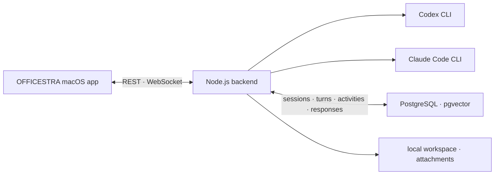

# OFFICESTRA

[한국어](README.md) | **English**

> A local-first macOS workspace that turns Codex CLI and Claude Code into a five-person AI team.

<p align="center">
  
  
  
  
</p>

OFFICESTRA replaces a collection of separate terminal sessions with one interactive office. Select an AI coworker, assign a task, and watch their user-visible progress and final response in real time. Every coworker has an independent role, CLI provider, model, reasoning effort, speed tier, permission level, and persistent conversation session. The backend keeps work running even when the app window is closed.

<p align="center">
  
</p>
<p align="center"><sub>The complete OFFICESTRA workspace.</sub></p>

## Core experience

- Assign each task to only the coworkers who need it.
- Choose Codex or Claude Code, a model, Fast or Standard mode, reasoning effort, and file permissions per coworker.
- See `Thinking` immediately, followed by user-visible messages, reasoning summaries, commands, tools, and file changes in their actual order.
- Copy individual Codex messages and inspect file-change results where they occurred.
- Restore persisted PostgreSQL state and provider-native CLI sessions after relaunching the app.
- Attach up to 20 files and view image thumbnails, generated images, and Markdown output.
- Search per-coworker history and the complete archive by task, response, model, session ID, reasoning effort, and speed tier.
- Switch between 2D and 3D offices and day or night themes while characters and speech bubbles reflect live work state.

## Workspace map

| Area | Purpose |
| --- | --- |
| Live office | Select five coworkers, inspect status, and switch between 2D, 3D, day, and night scenes |
| Coworker monitors | Open the selected coworker's conversations and provider session history |
| Archive cabinet | Search and inspect work from every coworker |
| Whiteboard | View Codex and Claude quota data plus optional CodexBar statistics |
| Live workspace | Follow progress events and final responses in chronological order |
| Command bar | Select coworkers, provider, model, speed, reasoning, permissions, attachments, and run or stop tasks |

The office scene is not decorative. Characters, monitors, the archive cabinet, and the whiteboard are interactive entry points into selection, history, and usage views.

## Features

### Coworkers and CLI providers

- Custom names, roles, and task instructions for every coworker.
- Independent Codex CLI or Claude Code selection per coworker.
- Model, Fast or Standard mode, reasoning effort, and read/write permission controls.
- Separate persistence of selected settings and the settings actually used for each turn.
- Provider-native session IDs for follow-up work.
- Model, speed, effort, permission, and role changes within the same provider keep the current session; switching between Codex and Claude starts a new one.
- In-session replies when an agent needs a user decision.
- Protection against concurrent tasks for the same coworker, with cancellation for active work.
- Separate visual states for quota exhaustion and ordinary execution failures.

### Live work

- A Node.js backend owns CLI child processes and their lifecycle.
- Tasks, responses, and user-visible progress events are written to PostgreSQL before the UI is notified.
- REST snapshots and WebSocket change notifications support reconnecting without losing work.
- Optimistic task cards display an animated `Thinking` state immediately after submission.
- Progress explanations, reasoning summaries, messages, commands, and tools retain database event order, while only adjacent operations are grouped.
- A single activity row moves from running to completed or failed instead of producing duplicate entries.
- Every user-visible message has its own copy action, and the final conclusion remains visually distinct.
- Codex file-change cards update in place with status, paths, and available addition/deletion counts.
- Claude Code timelines distinguish tool badges, shell commands, file edits, task lists, and collapsible thinking blocks.
- Reasoning, command, and tool groups start collapsed and can be expanded on demand.
- The feed follows the latest output until the user scrolls upward, then offers an explicit jump-to-latest control.
- History begins with 10 turns and loads 10 more at the top while preserving the current reading position, up to a 30-turn live window.
- Running and recently completed tasks stay visible even when they fall outside the normal window.
- Older records remain available through coworker monitors and the complete archive.
- Claude streaming output, Codex completed messages, and GitHub Flavored Markdown share one presentation layer.
- Code blocks, tables, headings, lists, links, and local generated-image previews are supported.
- Each task accepts up to 20 attachments with thumbnails and Finder integration.

### History and usage

- Search across coworker name, task, response, session ID, model, reasoning effort, and Fast or Standard mode.
- Preserve the provider, model, effort, speed tier, and external session ID used by every turn.
- Show the execution mode consistently in live cards, coworker history, and the complete archive.
- Display Codex and Claude five-hour and seven-day quota information and account-plan labels.
- Optionally display today's and trailing 30-day CodexBar cost and token statistics.
- Provide RAG storage APIs backed by pgvector vector search and PostgreSQL full-text search.

## Architecture



1. The app submits a coworker and task to `POST /api/agent-jobs`.
2. The UI renders an optimistic turn while the backend launches the selected CLI in the configured workspace.
3. The returned `turnId` reconciles the optimistic card with the persisted record.
4. Sequenced progress activities and response drafts are stored in PostgreSQL first.
5. `/ws` announces a change, and the app fetches the latest turn state from `GET /api/live-feed/:turnId`.
6. The final result appears when the turn reaches `completed`, `failed`, or `interrupted`.

As long as the backend remains running, tasks continue after the app window closes. On relaunch, the app loads persisted snapshots and reconnects to WebSocket updates.

## Parallel development and Git safety

When `workdir` is a Git repository, OFFICESTRA creates a dedicated branch and worktree for each active CLI session. Resumed Codex threads and Claude sessions keep using the same worktree.

After a successful task creates changes, the live task card shows the changed files and the diff against the base commit, then blocks additional work for that coworker. Nothing reaches the recorded source branch until the user selects **Approve and merge**. Rejected branches and worktrees are retained for recovery.

When a Codex-to-Claude or Claude-to-Codex switch would end an active session, unreviewed changes move to review and the settings request stops with `409`. An unchanged worktree is cleaned up automatically before the new provider session starts.

Immediately before merging, OFFICESTRA verifies that the source worktree is still on the recorded branch and clean, invalidates approval if the reviewed task tree changed, serializes merges per repository, and checks for conflicts before touching the source branch. Dirty source state and conflicts stop the merge for user review.

Non-Git workdirs continue to use the existing shared-folder behavior. A Git worktree isolates repository file changes only; it does not isolate processes, ports, databases, or files outside the workdir.

## Requirements

- macOS 14 or later.
- Swift 5.10 or later.
- Node.js and npm.
- Docker with Docker Compose.
- An installed and authenticated Codex CLI, Claude Code CLI, or both. If only one is installed, configure every coworker to use that provider before running tasks.
- Optional CodexBar CLI for additional usage statistics.

Available models depend on the installed CLI versions and account entitlements.

```sh
codex --version
claude --version
docker compose version
swift --version
```

## Quick start

### 1. Clone and configure

```sh
git clone https://github.com/neosp8888-design/office.git
cd office
```

Update the top-level `workdir` in `Sources/OfficeCore/Resources/characters.json` to the absolute path where agents should work.

```json
{
  "workdir": "/absolute/path/to/workspace"
}
```

Git task worktrees are created under `~/.officestra/worktrees` by default. Set the backend `OFFICE_WORKTREE_ROOT` environment variable to use a different location.

### 2. Start PostgreSQL and the backend

```sh
./scripts/start-backend.sh
```

The script starts a pgvector-enabled PostgreSQL container, installs Node.js dependencies when needed, prepares database migrations, and launches the backend on `127.0.0.1:4317`. It remains attached to the terminal.

```sh
curl -fsS http://127.0.0.1:4317/health
# {"ok":true}
```

### 3. Run the app

In a second terminal:

```sh
swift run OfficeLLM
```

The user-facing product name is `OFFICESTRA`. The Swift package product and internal executable remain `OfficeLLM` for compatibility.

## Agent runtime configuration

| CLI | Models exposed by the current UI | Reasoning effort | Fast mode |
| --- | --- | --- | --- |
| Codex | 5.6 Sol, 5.6 Terra, 5.6 Luna | `high`, `xhigh`, `max`, `ultra` | All displayed models |
| Claude Code | Opus 5, Fable, Sonnet 5 | `high`, `xhigh`, `max` | Opus 5 only |

Fast mode is separate from reasoning effort. OFFICESTRA passes either the `fast` or `default` service tier to Codex and passes the explicit `fastMode` setting to Claude Code. Enabling Claude Fast mode selects Opus 5 automatically, unsupported combinations sent directly to the API are rejected, and selecting Fable or Sonnet 5 returns Claude Code to Standard mode. Historical turns without a recorded speed tier are displayed as Standard.

The app presents a common three-level permission model over provider-specific values.

| App label | Codex | Claude Code |
| --- | --- | --- |
| Read only | `read-only` | `plan` |
| Write in workspace | `workspace-write` | `auto` |
| Full access | `danger-full-access` | `bypassPermissions` |

`Full access` can affect files outside the workspace and run system commands. Enable it only for coworkers whose role instructions and workspace you have reviewed.

## Local API

The default base URL is `http://127.0.0.1:4317`. This is a local control plane for the macOS app and does not provide authentication.

| Purpose | Method and path |
| --- | --- |
| Health | `GET /health` |
| Coworkers | `GET /api/characters` |
| Active sessions | `GET /api/active-sessions` |
| Complete or per-coworker history | `GET /api/history`, `GET /api/characters/:id/history` |
| Live feed | `GET /api/live-feed`, `GET /api/live-feed/:turnId` |
| Change notifications | `WS /ws` |
| Coworker settings | `PUT /api/characters/:id/name`, `PUT /api/characters/:id/settings` |
| Role instructions | `PUT /api/characters/:id/identity-prompt` |
| Start a task | `POST /api/agent-jobs` |
| Stop a task | `DELETE /api/agent-jobs/:characterId` |
| Inspect Git changes | `GET /api/workspace-reviews/:turnId` |
| Approve or reject Git changes | `POST /api/workspace-reviews/:turnId/approve`, `POST /api/workspace-reviews/:turnId/reject` |
| RAG storage and search | `POST /api/rag/documents`, `POST /api/rag/search` |

Approval and rejection requests use `application/json`. Approval must send the
`reviewTree` from the reviewed response as `{"reviewTree":"..."}`; rejection
sends `{}`. A changed tree or stale review value stops with `409`, and the
latest diff must be reviewed again.

Example task request:

```sh
curl -X POST http://127.0.0.1:4317/api/agent-jobs \
  -H 'content-type: application/json' \
  -d '{
    "characterId": "right-woman",
    "prompt": "Review the README setup instructions.",
    "attachmentPaths": []
  }'
```

Accepted requests return `202` with a `turnId`, `conversationId`, and `status`. A second task for an already-busy coworker returns `409`; different coworkers may run concurrently.

## Data and security boundaries

- Tasks, responses, sessions, and activity records are stored in a local PostgreSQL Docker volume.
- Attachments are copied into `.office-attachments/` under the configured workspace. When `workdir` points to another Git repository, add this directory to that repository's `.gitignore` as well.
- Approved worktrees are cleaned up after merging, while rejected worktrees and branches are retained for recovery and must be removed manually when no longer needed.
- OFFICESTRA does not store API keys. It uses each CLI's existing local authentication.
- The backend binds to `127.0.0.1` by default.
- PostgreSQL is exposed only on `127.0.0.1:54329` by the included Compose configuration.
- The API has no authentication and must not be exposed directly to a LAN or the internet.
- The included PostgreSQL credentials are loopback-only local development values and are unsafe for external exposure.
- Prompts, commands, and file paths may appear in progress logs and history.
- Review screenshots and logs for project names, absolute paths, and usage data before sharing them.

The default PostgreSQL mapping is host port `54329` to container port `5432`. See `backend/.env.example` for supported environment variables. The current start script does not automatically load `backend/.env`.

## RAG storage and search

The initial schema provides `vector(1536)` embeddings, an HNSW cosine index, and PostgreSQL `tsvector` search with a GIN index.

- Store documents and optional embeddings with `POST /api/rag/documents`.
- Run vector or full-text queries with `POST /api/rag/search`.

Embedding generation and automatic prompt injection of search results are not included. Connect those steps in the workflow that needs them.

## Development and validation

```sh
npm --prefix backend run check
npm --prefix backend test
swift test -Xswiftc -warnings-as-errors
```

Build and verify a local app bundle:

```sh
./scripts/build-app.sh
codesign --verify --deep --strict --verbose=2 dist/OFFICESTRA.app
open dist/OFFICESTRA.app
```

The bundle uses ad hoc signing for local execution. The backend must still run as a separate process when launching the app bundle.

## Project layout

```text
Sources/OfficeCore/       Shared configuration, models, and office assets
Sources/OfficeGame/       SwiftUI and SpriteKit app with live-work UI
backend/                  REST/WebSocket server and CLI runtime
database/migrations/      PostgreSQL and pgvector schema
infra/                    Local PostgreSQL Docker Compose configuration
scripts/                  Backend startup and macOS app-bundle scripts
Tests/                    Swift unit tests
backend/test/             Node.js backend unit tests
docs/images/              Curated screenshots used by public documentation
```

See [`APP-DESIGN.md`](APP-DESIGN.md) for the product design background and [`LLM-WIRING.md`](LLM-WIRING.md) for the CLI integration design.

## Current limitations

- OFFICESTRA is macOS-only.
- Users must install and authenticate the CLI providers and Docker locally.
- The model list is currently defined in code rather than discovered dynamically from every CLI model.
- Claude Code Fast mode is currently limited to Opus 5.
- Git worktrees do not isolate processes, ports, databases, or files outside the repository.
- A full-access agent can bypass the worktree boundary by committing or pushing through the source repository's absolute path. OFFICESTRA detects a dirty source tree but cannot distinguish a clean direct commit, so production use should pair `workspace-write` or `auto` permissions with protected remote branch rules.
- Conflict resolution and cleanup of a dirty source worktree require user judgment.
- There is no orchestrator that automatically decomposes one large task and assigns it across the whole team.
- RAG embedding generation and automatic retrieval injection require additional integration.
- The unauthenticated local API must not be used as an externally exposed service.
