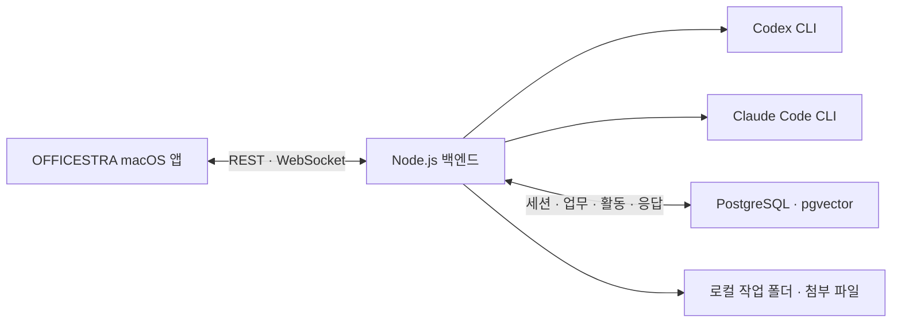

# OFFICESTRA

**한국어** | [English](README.en.md)

> 로컬 Codex CLI와 Claude Code를 다섯 명의 AI 직원처럼 운영하는 macOS 업무실.

<p align="center">
  
  
  
  
</p>

OFFICESTRA는 여러 CLI 세션을 터미널 창마다 따로 관리하는 대신, 하나의
오피스 화면에서 직원을 선택하고 업무를 맡기며 진행 상태와 결과를 확인하는
로컬 우선 데스크톱 앱이다. 각 직원은 독립된 역할 지침·CLI·모델·추론
단계·Fast 또는 Standard 모드·권한·대화 세션을 갖고, 백엔드는 앱 창이
닫혀도 업무를 계속 실행한다.

_Local-first macOS command center for running Codex CLI and Claude Code as a
five-person AI team._

<p align="center">
  
</p>
<p align="center"><sub>OFFICESTRA 전체 앱 화면.</sub></p>

## 핵심 경험

- 다섯 명의 직원에게 필요한 업무만 각각 배정한다.
- 직원마다 Codex 또는 Claude Code, 모델, Fast·Standard, 추론 단계와 파일 권한을 선택한다.
- 입력 즉시 `생각 중` 상태부터 메시지·추론·명령·도구·파일 변경을 실제 순서로 확인한다.
- Codex 공개 메시지를 각각 복사하고 파일 변경 결과를 발생 위치에서 확인한다.
- 앱을 닫았다 다시 열어도 PostgreSQL 상태와 CLI 세션을 복구한다.
- 파일을 최대 20개까지 첨부하고 이미지 썸네일·생성 이미지·Markdown 결과를 본다.
- 직원별 기록과 전체 보관함을 Fast·Standard까지 포함해 검색한다.
- 2D·3D 오피스와 낮·밤 테마를 전환하며 실제 업무 상태를 캐릭터와 말풍선으로 본다.

## 화면 구성

| 영역 | 하는 일 |
| --- | --- |
| 실시간 오피스 | 다섯 직원 선택, 업무 상태 확인, 2D·3D 및 낮·밤 전환 |
| 직원 모니터 | 해당 직원의 대화와 세션 기록 열기 |
| 캐비닛 | 모든 직원의 업무 기록 검색 및 상세 보기 |
| 화이트보드 | Codex·Claude 잔여량과 선택적인 CodexBar 통계 확인 |
| 실시간 업무실 | 선택한 직원의 진행 이벤트와 최종 응답을 시간순으로 확인 |
| 하단 입력창 | 직원·CLI·모델·Fast·Standard·추론·권한 선택, 파일 첨부, 업무 실행·중단 |

오피스 장면은 장식용 배경이 아니다. 캐릭터, 모니터, 캐비닛과 화이트보드가
각각 실제 선택·기록·사용량 화면으로 연결되는 인터랙티브 인터페이스다.

## 주요 기능

### 직원과 CLI

- 직원별 이름과 역할·업무 지침 설정
- Codex CLI와 Claude Code를 직원마다 독립적으로 선택
- 모델·Fast 또는 Standard·추론 단계·읽기/쓰기 권한 설정
- 선택 모드와 실제 실행 모드를 직원 설정과 각 업무 기록에 별도로 저장
- 직원별 외부 CLI 세션 저장과 후속 업무 재개
- 설정 변경 시 기존 세션 종료 후 새 실행 세션 시작
- 사용자 판단이 필요한 질문을 같은 세션에서 이어서 답변
- 같은 직원의 중복 업무 차단과 실행 중 업무 취소
- 모델 한도 소진과 일반 실행 실패를 다른 상태로 표시

### 실시간 업무

- Node.js 백엔드가 CLI 자식 프로세스의 실행과 종료를 소유
- PostgreSQL에 업무·응답·공개 진행 이벤트를 먼저 저장
- WebSocket 변경 알림과 REST 스냅샷을 조합한 재연결
- 업무 전송 즉시 임시 카드와 움직이는 `생각 중` 상태 표시
- DB 발생 순서대로 진행 설명·추론·메시지·명령·도구를 배치하고 연속 작업만 그룹화
- 실행 중 활동을 같은 이벤트 행에서 완료·실패 상태로 갱신해 중복 표시 방지
- 공개 메시지마다 개별 복사 버튼과 마지막 결론 구분 제공
- Codex 파일 변경 시작 카드를 같은 타임라인 위치에서 완료·실패와 경로로 갱신하고 가능한 추가·삭제 통계 표시
- Claude Code는 도구 이름 배지와 셸 명령, 파일 편집 카드, 할 일 체크리스트, 접히는 사고 블록으로 구분해 표시
- 추론·명령·도구 작업 그룹은 기본 닫힘이며 필요할 때 펼침
- 최신 대화를 자동 추적하되 사용자가 위로 스크롤하면 추적을 멈추고 버튼으로 재개
- 최근 10건부터 시작해 상단에서 10건씩, 최대 30건까지 이전 업무를 읽던 위치 그대로 추가
- 진행 중이거나 최근 종료된 업무는 기본 30건 화면 창 밖에서도 결과가 사라지지 않게 유지
- 화면 창보다 오래된 기록은 직원 모니터와 전체 대화 보관함에서 조회
- Claude 스트리밍 출력과 Codex 완성 메시지, GitHub Flavored Markdown 렌더링
- 코드 블록, 표, 제목, 목록, 링크와 로컬 생성 이미지 미리보기
- 업무당 최대 20개 파일 첨부, 이미지 썸네일과 Finder 열기

### 기록과 사용량

- 직원명·업무·응답·세션 ID·모델·추론 단계·Fast·Standard를 한 번에 검색
- 실행 당시 CLI·모델·추론·Fast 또는 Standard 설정과 외부 세션 ID 보존
- 실시간 카드, 직원별 기록과 전체 대화 보관함에서 실행 모드를 항상 표시
- Codex·Claude의 5시간·7일 잔여량과 요금제 표시
- 선택적으로 CodexBar의 오늘·최근 30일 비용과 토큰 통계 표시
- pgvector 벡터 검색과 PostgreSQL 전문 검색을 위한 RAG API

## 동작 구조



1. 앱이 `POST /api/agent-jobs`로 직원과 업무를 지정한다.
2. 앱은 임시 턴을 즉시 표시하고 백엔드는 선택된 CLI를 작업 폴더에서 실행한다.
3. 백엔드가 반환한 `turnId`로 임시 턴을 실제 저장 기록과 합친다.
4. 순번과 이벤트 키가 있는 진행 활동·응답 초안을 PostgreSQL에 먼저 저장한다.
5. `/ws`가 변경 사실을 알리면 앱은 `GET /api/live-feed/:turnId`로 최신 상태만 읽는다.
6. `completed`, `failed`, `interrupted` 상태가 되면 최종 결과를 표시한다.

백엔드가 계속 실행 중이면 앱 창을 닫아도 직원 업무는 이어진다. 앱을 다시
열면 저장된 스냅샷을 읽고 WebSocket에 재연결한다.

## 병렬 개발과 Git 안전 수칙

> [!IMPORTANT]
> 현재 모든 직원은 하나의 `workdir`를 공유한다. OFFICESTRA는 브랜치,
> Git worktree, 머지와 파일 충돌을 자동 관리하지 않는다.

서로 다른 직원은 동시에 실행할 수 있지만 같은 파일을 함께 수정하면 변경을
덮어쓰거나 테스트·커밋 범위가 섞일 수 있다. 한 작업 폴더에서는 다음 운영을
권장한다.

- 쓰기 업무는 한 번에 한 직원만 담당한다.
- 조사·리뷰·테스트처럼 읽기 중심 업무는 병렬로 배정한다.
- 새 개발 업무를 보내기 전에 실행 중인 직원과 `git status`를 확인한다.
- 같은 기능을 진짜 병렬 개발하려면 직원별 `git worktree + branch`를 준비한다.
- 최종 통합·충돌 해결·전체 테스트는 한 명의 담당자가 수행한다.

직원을 자유롭게 선택하는 것은 문제가 아니다. 겹치는 쓰기 범위를 동시에
맡기는 것이 위험하다.

## 요구 사항

- macOS 14 이상
- Swift 5.10 이상
- Node.js와 npm
- Docker와 Docker Compose
- 사용할 Codex CLI 또는 Claude Code CLI의 설치 및 로그인
- 선택 사항으로 사용량 통계를 표시할 CodexBar CLI

사용 가능한 모델은 설치된 CLI 버전과 계정 권한에 따라 달라질 수 있다.

```sh
codex --version
claude --version
docker compose version
swift --version
```

## 빠른 시작

### 1. 저장소 준비

```sh
git clone https://github.com/neosp8888-design/office.git
cd office
```

`Sources/OfficeCore/Resources/characters.json`의 최상위 `workdir`를 에이전트가
실제로 작업할 절대 경로로 바꾼다.

```json
{
  "workdir": "/absolute/path/to/workspace"
}
```

### 2. PostgreSQL과 백엔드 실행

```sh
./scripts/start-backend.sh
```

스크립트는 pgvector PostgreSQL 컨테이너를 시작하고 Node 의존성과 DB
마이그레이션을 준비한 뒤 `127.0.0.1:4317`에서 백엔드를 실행한다. 이 명령은
전경에서 계속 실행되므로 첫 번째 터미널을 열어둔다.

```sh
curl -fsS http://127.0.0.1:4317/health
# {"ok":true}
```

### 3. 앱 실행

두 번째 터미널에서 앱을 실행한다.

```sh
swift run OfficeLLM
```

사용자에게 보이는 앱 이름은 `OFFICESTRA`지만 SwiftPM 제품명과 내부 실행
파일명은 기존 호환성을 위해 `OfficeLLM`을 유지한다.

## 직원 실행 설정

| CLI | 모델 선택지 | 추론 단계 | Fast 지원 |
| --- | --- | --- | --- |
| Codex | 5.6 Sol, 5.6 Terra, 5.6 Luna | `high`, `xhigh`, `max`, `ultra` | 모든 표시 모델 |
| Claude Code | Opus 5, Fable, Sonnet 5 | `high`, `xhigh`, `max` | Opus 5 전용 |

Fast를 켜거나 끌 때마다 Codex에는 `fast` 또는 `default` 서비스 등급을,
Claude Code에는 `fastMode` 설정을 명시적으로 전달한다. 앱에서 Claude Fast를
켤 때 현재 모델이 지원되지 않으면 Opus 5로 맞추며, 잘못 조합한 직접 API
요청은 거절한다. Fable이나 Sonnet 5를 선택하면 Standard로 돌아간다. 실행
모드는 추론 단계와 독립적으로 저장되며 과거 값이 없는 업무는 보관함에서
Standard로 표시한다.

권한은 두 CLI의 서로 다른 값을 앱의 공통 3단계로 표시한다.

| 앱 표시 | Codex | Claude Code |
| --- | --- | --- |
| 읽기 전용 | `read-only` | `plan` |
| 작업 폴더 쓰기 | `workspace-write` | `auto` |
| 전체 허용 | `danger-full-access` | `bypassPermissions` |

`전체 허용`은 작업 폴더 밖의 파일과 시스템 명령에도 영향을 줄 수 있다.
역할 지침과 `workdir`를 확인한 뒤 필요한 직원에게만 사용한다.

## 로컬 API

기본 주소는 `http://127.0.0.1:4317`이다. 이 API는 앱과 같은 Mac에서 쓰는
로컬 제어면이며 인증을 제공하지 않는다.

| 목적 | 메서드와 경로 |
| --- | --- |
| 상태 확인 | `GET /health` |
| 직원 목록 | `GET /api/characters` |
| 활성 세션 | `GET /api/active-sessions` |
| 전체·직원별 기록 | `GET /api/history`, `GET /api/characters/:id/history` |
| 실시간 피드 | `GET /api/live-feed`, `GET /api/live-feed/:turnId` |
| 변경 알림 | `WS /ws` |
| 직원 설정 | `PUT /api/characters/:id/name`, `PUT /api/characters/:id/settings` |
| 역할 지침 | `PUT /api/characters/:id/identity-prompt` |
| 업무 실행 | `POST /api/agent-jobs` |
| 업무 중단 | `DELETE /api/agent-jobs/:characterId` |
| RAG 문서·검색 | `POST /api/rag/documents`, `POST /api/rag/search` |

업무 실행 예시는 다음과 같다.

```sh
curl -X POST http://127.0.0.1:4317/api/agent-jobs \
  -H 'content-type: application/json' \
  -d '{
    "characterId": "right-woman",
    "prompt": "README 설치 절차를 검토해줘.",
    "attachmentPaths": []
  }'
```

요청이 접수되면 `202`와 함께 `turnId`, `conversationId`, `status`가 반환된다.
같은 직원이 이미 실행 중이면 `409`를 반환하며, 서로 다른 직원은 병렬로
실행할 수 있다.

## 데이터와 보안 경계

- 업무·응답·세션·활동 기록은 로컬 PostgreSQL Docker 볼륨에 저장된다.
- 첨부 파일은 작업 폴더의 `.office-attachments/`에 복사된다. 다른 Git 저장소를 `workdir`로 사용한다면 해당 저장소의 `.gitignore`에도 이 폴더를 추가해야 한다.
- OFFICESTRA는 API 키를 직접 저장하지 않고 각 CLI의 기존 로컬 로그인을 사용한다.
- 백엔드는 기본적으로 `127.0.0.1`에만 바인딩된다.
- PostgreSQL의 호스트 포트도 `127.0.0.1:54329`에만 바인딩된다.
- API에는 인증이 없으므로 포트를 LAN이나 인터넷에 그대로 노출하면 안 된다.
- Compose의 PostgreSQL 계정은 루프백 전용 로컬 개발값이므로 외부에 노출하면 안 된다.
- 진행 로그와 보관함에는 프롬프트·명령·파일 경로가 포함될 수 있다.
- 화면 캡처나 로그를 공유하기 전에 프로젝트명, 절대 경로와 사용량 정보를 확인한다.

기본 PostgreSQL 포트는 호스트 `54329`, 컨테이너 `5432`다. 환경 변수 목록은
`backend/.env.example`에서 확인할 수 있으며, 현재 시작 스크립트는
`backend/.env`를 자동으로 불러오지 않는다.

## RAG 저장과 검색

초기 스키마는 `vector(1536)` 임베딩, HNSW 코사인 인덱스, `tsvector`와 GIN
인덱스를 제공한다.

- `POST /api/rag/documents`로 문서와 선택적인 임베딩 저장
- `POST /api/rag/search`로 벡터 또는 전문 검색

임베딩 생성과 검색 결과의 자동 프롬프트 주입은 포함하지 않는다. 필요한
워크플로에서 별도로 연결해야 한다.

## 개발과 검증

```sh
npm --prefix backend run check
npm --prefix backend test
swift test -Xswiftc -warnings-as-errors
```

로컬 앱 번들을 만들고 서명을 확인할 수 있다.

```sh
./scripts/build-app.sh
codesign --verify --deep --strict --verbose=2 dist/OFFICESTRA.app
open dist/OFFICESTRA.app
```

앱 번들은 로컬 실행용 ad-hoc 서명을 사용한다. 번들로 실행할 때도 백엔드는
별도 프로세스로 실행 중이어야 한다.

## 프로젝트 구조

```text
Sources/OfficeCore/       공통 설정·모델·오피스 리소스
Sources/OfficeGame/       SwiftUI·SpriteKit 앱과 실시간 업무 UI
backend/                  REST·WebSocket 서버와 CLI 실행 런타임
database/migrations/      PostgreSQL·pgvector 스키마
infra/                    로컬 PostgreSQL Docker Compose 설정
scripts/                  백엔드 시작과 macOS 앱 번들 빌드
Tests/                    Swift 단위 테스트
backend/test/             Node.js 백엔드 단위 테스트
docs/images/              공개 문서용 선별 화면 이미지
```

구현 배경은 [`APP-DESIGN.md`](APP-DESIGN.md), CLI 연결 방식은
[`LLM-WIRING.md`](LLM-WIRING.md)에서 더 자세히 볼 수 있다.

## 현재 제한 사항

- macOS 전용 앱이다.
- CLI와 Docker 설치·로그인은 사용자가 로컬에서 준비해야 한다.
- 모델 목록은 현재 코드에 정의돼 있으며 CLI의 모든 모델을 자동 탐색하지 않는다.
- Claude Code Fast 모드는 현재 Opus 5에서만 사용할 수 있다.
- 여러 직원의 브랜치·worktree·머지와 파일 충돌을 자동 관리하지 않는다.
- 하나의 큰 업무를 자동 분해해 전 직원에게 배정하는 오케스트레이터는 없다.
- RAG 임베딩 생성과 검색 결과 자동 주입은 별도 구현이 필요하다.
- 로컬 API는 인증이 없으므로 외부 네트워크용 서비스로 사용하면 안 된다.
