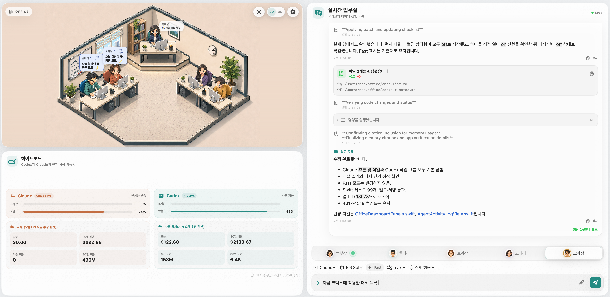
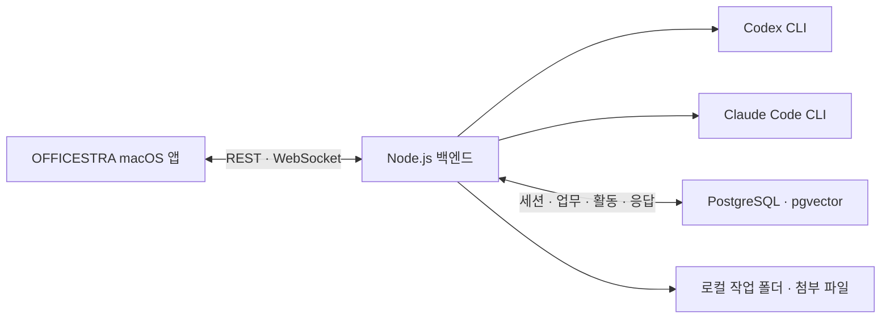

# OFFICESTRA

**한국어** | [English](README.en.md)

> 로컬 Codex CLI와 Claude Code를 다섯 명의 AI 직원처럼 운영하는 macOS 업무실.

<p align="center">
  
  
  
  
</p>

OFFICESTRA는 여러 CLI 세션을 터미널 창마다 따로 관리하는 대신, 하나의
오피스 화면에서 직원을 선택하고 업무를 맡기며 진행 상태와 결과를 확인하는
로컬 우선 데스크톱 앱이다. 각 직원은 독립된 역할 지침·CLI·모델·추론
단계·Fast 또는 Standard 모드·권한·대화 세션을 갖고, 백엔드는 앱 창이
닫혀도 업무를 계속 실행한다.

_Local-first macOS command center for running Codex CLI and Claude Code as a
five-person AI team._

<p align="center">
  
</p>
<p align="center"><sub>OFFICESTRA 전체 앱 화면.</sub></p>

## 핵심 경험

- 다섯 명의 직원에게 필요한 업무만 각각 배정하거나 누구에게든 협업이나 업무 분배를 요청하면, 해당 직원이 로컬 API로 다른 직원에게 프롬프트를 넣고 진행 상황을 모니터링한 뒤 종합해 보고한다.
- 직원마다 Codex 또는 Claude Code, 모델, Fast·Standard, 추론 단계와 파일 권한을 선택한다.
- 입력 즉시 `생각 중` 상태부터 메시지·추론·명령·도구·파일 변경을 실제 순서로 확인한다.
- Codex 공개 메시지를 각각 복사하고 파일 변경 결과를 발생 위치에서 확인한다.
- 앱을 닫았다 다시 열어도 PostgreSQL 상태와 CLI 세션을 복구한다.
- 파일을 최대 20개까지 첨부하고 이미지 썸네일·생성 이미지·Markdown 결과를 본다.
- 직원별 기록과 전체 보관함을 Fast·Standard까지 포함해 검색한다.
- 2D·3D 오피스와 낮·밤 테마를 전환하며 실제 업무 상태를 캐릭터 애니메이션으로 본다.

## 화면 구성

| 영역 | 하는 일 |
| --- | --- |
| 실시간 오피스 | 다섯 직원 선택, 업무 상태 확인, 2D·3D 및 낮·밤 전환 |
| 직원 모니터 | 해당 직원의 대화와 세션 기록 열기 |
| 캐비닛 | 모든 직원의 업무 기록 검색 및 상세 보기 |
| 화이트보드 | Codex·Claude 잔여량과 선택적인 CodexBar 통계 확인 |
| 실시간 업무실 | 선택한 직원의 진행 이벤트와 최종 응답을 시간순으로 확인 |
| 하단 입력창 | 직원·CLI·모델·Fast·Standard·추론·권한 선택, 파일 첨부, 업무 실행·중단 |

오피스 장면은 장식용 배경이 아니다. 캐릭터, 모니터, 캐비닛과 화이트보드가
각각 실제 선택·기록·사용량 화면으로 연결되는 인터랙티브 인터페이스다.

## 주요 기능

### 직원과 CLI

- 직원별 이름과 역할·업무 지침 설정
- Codex CLI와 Claude Code를 직원마다 독립적으로 선택
- 모델·Fast 또는 Standard·추론 단계·읽기/쓰기 권한 설정
- 선택 모드와 실제 실행 모드를 직원 설정과 각 업무 기록에 별도로 저장
- 직원별 외부 CLI 세션 저장과 후속 업무 재개
- 같은 CLI의 모델·Fast·추론·권한·역할 변경은 기존 세션을 유지하고,
  Codex ↔ Claude 전환만 새 실행 세션 시작(세션이 초기화되어도 DB를 통해 이전작업을 이어갈수 있음)
- 사용자 판단이 필요한 질문을 같은 세션에서 이어서 답변
- 같은 직원의 중복 업무 차단과 실행 중 업무 취소
- 모델 한도 소진과 일반 실행 실패를 다른 상태로 표시

### 실시간 업무

- Node.js 백엔드가 CLI 자식 프로세스의 실행과 종료를 소유
- PostgreSQL에 업무·응답·공개 진행 이벤트를 먼저 저장
- WebSocket 변경 알림과 REST 스냅샷을 조합한 재연결
- 업무 전송 즉시 임시 카드와 움직이는 `생각 중` 상태 표시
- DB 발생 순서대로 진행 설명·추론·메시지·명령·도구를 배치하고 연속 작업만 그룹화
- 실행 중 활동을 같은 이벤트 행에서 완료·실패 상태로 갱신해 중복 표시 방지
- 공개 메시지마다 개별 복사 버튼과 마지막 결론 구분 제공
- Codex 파일 변경 시작 카드를 같은 타임라인 위치에서 완료·실패와 경로로 갱신하고 가능한 추가·삭제 통계 표시
- Claude Code는 도구 이름 배지와 셸 명령, 파일 편집 카드, 할 일 체크리스트, 접히는 사고 블록으로 구분해 표시
- 추론·명령·도구 작업 그룹은 기본 닫힘이며 필요할 때 펼침
- 최신 대화를 자동 추적하되 사용자가 위로 스크롤하면 추적을 멈추고 버튼으로 재개
- 최근 10건부터 시작해 상단에서 10건씩, 최대 30건까지 이전 업무를 읽던 위치 그대로 추가
- 진행 중이거나 최근 종료된 업무는 기본 30건 화면 창 밖에서도 결과가 사라지지 않게 유지
- 화면 창보다 오래된 기록은 직원 모니터와 전체 대화 보관함에서 조회
- Claude 스트리밍 출력과 Codex 완성 메시지, GitHub Flavored Markdown 렌더링
- 코드 블록, 표, 제목, 목록, 링크와 로컬 생성 이미지 미리보기
- 업무당 최대 20개 파일 첨부, 이미지 썸네일과 Finder 열기

### 기록과 사용량

- 직원명·업무·응답·세션 ID·모델·추론 단계·Fast·Standard를 한 번에 검색
- 실행 당시 CLI·모델·추론·Fast 또는 Standard 설정과 외부 세션 ID 보존
- 실시간 카드, 직원별 기록과 전체 대화 보관함에서 실행 모드를 항상 표시
- Codex·Claude의 5시간·7일 잔여량과 요금제 표시
- 선택적으로 CodexBar의 오늘·최근 30일 비용과 토큰 통계 표시
- 완료 업무를 PostgreSQL `work_records` 원본으로 저장하고 검색 가능한 기록을
  `rag_documents` 파생 검색 자료로 동기화
- 새 업무에 같은 저장소의 관련 기록을 최대 3개 비신뢰 참고 자료로 자동 주입
- 실제 사용한 RAG·DB·파일·웹·도구·스킬 근거를 응답과 함께 표시하고 웹은
  클릭, 파일은 Finder로 열기

## 동작 구조



1. 앱이 `POST /api/agent-jobs`로 직원과 업무를 지정한다.
2. 앱은 임시 턴을 즉시 표시하고 백엔드는 선택된 CLI를 작업 폴더에서 실행한다.
3. 백엔드가 반환한 `turnId`로 임시 턴을 실제 저장 기록과 합친다.
4. 순번과 이벤트 키가 있는 진행 활동·응답 초안을 PostgreSQL에 먼저 저장한다.
5. `/ws`가 변경 사실을 알리면 앱은 `GET /api/live-feed/:turnId`로 최신 상태만 읽는다.
6. `completed`, `failed`, `interrupted` 상태가 되면 최종 결과를 표시한다.

백엔드가 계속 실행 중이면 앱 창을 닫아도 직원 업무는 이어진다. 앱을 다시
열면 저장된 스냅샷을 읽고 WebSocket에 재연결한다.

## Slack에서 직원 호출

Slack Socket Mode를 켜면 4317 포트를 외부에 공개하지 않고도 모바일 Slack에서
다섯 직원을 호출할 수 있다. `/office`로 기본 직원을 선택하고 봇에게 DM을
보내거나 채널에서 봇을 멘션하면 해당 직원의 CLI 업무가 시작된다.

- 직원 이름과 선택 버튼은 PostgreSQL의 현재 설정을 사용한다.
- Slack 스레드마다 OFFICESTRA 대화 ID를 보존해 후속 답변을 같은 대화로 전달한다.
- 진행 중인 활동은 한 상태 메시지에서 갱신하고 최종 응답은 같은 스레드에 남긴다.
- 사용자 답변이 필요한 업무는 같은 스레드에 답하면 기존 직원 세션으로 이어진다.
- Git 변경이 승인 대기 상태이면 Slack에서 승인·거절할 수 있다.
- 허용된 Slack 사용자 ID만 CLI 업무를 시작할 수 있다.

설정 방법은 다음과 같다.

1. Slack 앱 생성 화면에서 `integrations/slack/manifest.yaml`을 가져온다.
2. 앱을 워크스페이스에 설치해 `xoxb-` Bot Token을 발급한다.
3. `connections:write` App Token을 만들어 `xapp-` 값을 발급한다.
4. `integrations/slack/slack.env.example`을 참고해
   `~/.officestra/slack.env`를 만들고 파일 권한을 `600`으로 설정한다.
5. 백엔드를 재시작한 뒤 로그에서 `OFFICESTRA Slack Socket Mode 연결 완료`를 확인한다.

토큰 파일은 저장소 밖에 두며 Git에 커밋하지 않는다. 토큰이 없으면 Slack 기능만
비활성화되고 macOS 앱과 기존 백엔드는 그대로 동작한다.

## 병렬 개발과 Git 안전 수칙

Git 저장소를 `workdir`로 지정하면 OFFICESTRA가 검토 단위 업무마다 전용
branch와 worktree를 만든다. worktree는 파일 변경만 격리하며 Codex thread나
Claude session의 수명주기와는 독립적이다. 승인·병합·거절 뒤 새 worktree를
만들어도 같은 직원의 CLI 세션은 그대로 재개한다.

변경이 생긴 업무가 성공하면 우측 업무 카드가 기준 커밋 대비 파일 목록과
diff를 보여주고 해당 직원의 다음 업무를 잠근다. 사용자가 `승인 후 병합`을
누른 뒤에만 원본 branch에 병합한다. 거절한 branch와 worktree는 복구할 수
있도록 보존한다.

Codex ↔ Claude 전환으로 활성 세션을 끝낼 때 변경사항이 남아 있으면 먼저
검토 대기로 전환하고 설정 저장을 `409`로 중단한다. 변경사항이 없는 빈
worktree만 자동으로 정리한 뒤 새 provider 세션을 시작한다. worktree 자체의
승인·병합·거절은 provider 세션을 종료하지 않는다.

병합 직전에는 다음 조건을 다시 검사한다.

- 원본 작업 트리가 처음 기록한 branch에 있고 미추적 파일까지 clean인지 확인한다.
- 검토 뒤 작업 tree가 달라졌으면 기존 승인을 무효화하고 새 diff를 요구한다.
- 저장소별 병합을 직렬화하고 최신 원본과의 충돌을 원본 변경 전에 검사한다.
- 충돌이나 dirty 원본을 발견하면 자동 해결하지 않고 병합을 중단한다.

Git 저장소가 아닌 `workdir`는 기존 공유 폴더 방식으로 실행된다. worktree는 Git
파일 변경만 격리하며 프로세스, 포트, 데이터베이스와 작업 폴더 밖의 파일은
격리하지 않는다.

## 설치

OFFICESTRA Community Preview는 macOS 14 이상에서 동작한다. 일반 비-Git
폴더를 사용하는 사람은 Swift, Xcode, Node.js, npm, Git이나 저장소 clone이
필요 없다. 앱에 Node와 백엔드가 포함되어 있고, 첫 실행 도우미가 기존 데이터를
보존하면서 PostgreSQL 준비·마이그레이션·백엔드 연결을 자동 처리한다.

현재 미리보기에서 사용자가 먼저 준비할 것은 두 가지뿐이다.

- [Docker Desktop](https://www.docker.com/products/docker-desktop/) 설치와 최초 실행
- Codex CLI 또는 Claude Code CLI 중 하나의 설치와 로그인

Git 저장소를 선택해 worktree 격리·검토·병합 기능을 쓰려는 경우에만 Mac에
`git`이 필요하다. Git이 없는 일반 폴더는 공유 폴더 방식으로 그대로 동작한다.

모델 목록은 설치된 CLI 버전과 계정 권한에 따라 달라질 수 있다.

### 가장 쉬운 방법

1. [Releases](https://github.com/neosp8888-design/office/releases)에서 Mac
   아키텍처에 맞는 `adhoc` DMG를 받는다. Apple Silicon(M1 이상)은 `arm64`,
   Intel Mac은 `x86_64` 파일을 선택한다. Community Preview는 Apple Developer
   ID 서명이나 Apple 공증을 받지 않았으므로 macOS가 첫 실행을 차단할 수 있다.
   공식 저장소의 Release 파일인지 확인하고 함께 제공되는 `SHA256SUMS`와
   일치할 때만 설치한다.
2. DMG를 열어 `OFFICESTRA.app`을 `Applications`로 끌어 놓고 실행한다.
3. macOS가 차단하면 임의의 터미널 명령을 실행하지 않는다. 앱을 한 번 실행한 뒤
   `Apple 메뉴 → 시스템 설정 → 개인정보 보호 및 보안 → 보안 → 그래도 열기`를
   누르고 로그인 암호 또는 Touch ID로 인증한 다음 **열기**를 선택한다. 이 예외는
   OFFICESTRA 앱 하나에만 적용된다. **그래도 열기**는 첫 실행 시도 뒤 약 1시간
   동안 표시된다. 자세한 내용은 [Apple 공식 안내](https://support.apple.com/ko-kr/102445)를 참고한다.
4. 직원들이 작업할 프로젝트 폴더를 선택한다.
5. 준비 화면에서 Docker·Codex·Claude 상태를 확인한다. 누락된 항목만 준비한 뒤
   **다시 확인**을 누르면 DB와 백엔드가 자동으로 이어서 시작된다.
6. 새 설치에서는 Codex 또는 Claude Code 하나만 로그인돼 있어도 다섯 직원이
   그 CLI로 자동 맞춰지고 바로 첫 업무를 보낼 수 있다. 기존 데이터에 다른 CLI
   직원 설정이 남아 있으면 대화와 설정을 바꾸지 않고 해당 로그인을 요청한다.

`xattr`, `sudo spctl --master-disable` 또는 Gatekeeper 전체 비활성화는 필요하지
않으며 권장하지 않는다. 보안 예외를 허용하고 싶지 않으면 아래 개발자용 절차로
이 태그의 소스를 직접 빌드한다. 체크섬은 Release 파일의 무결성을 확인하지만
Apple 공증을 대신하지 않는다. 회사에서 관리하는 Mac은 조직 정책에 따라
**그래도 열기**가 제한될 수 있다.

Apple Silicon DMG와 `SHA256SUMS`를 다운로드한 경우 터미널에서 아래 한 줄을
실행해 `OK`가 나오는지 확인한다. Intel Mac은 파일명의 `arm64`를 `x86_64`로
바꾼다.

```sh
cd "$HOME/Downloads" && grep 'OFFICESTRA-1.3.0-3-macOS-arm64-adhoc.dmg$' SHA256SUMS | shasum -a 256 -c -
```

설치 오류가 나면 준비 화면의 **로그 열기**로 진단 폴더를 열 수 있다. 앱은
모르는 4317 프로세스를 종료하지 않으며, 다른 프로젝트용 OFFICESTRA 백엔드가
실행 중이면 경로를 표시하고 중단한다.

릴리스 담당자의 Community Preview와 향후 Developer ID 공증 배포 절차는
[릴리스 가이드](docs/RELEASING.md)에 정리되어 있다.

<details>
<summary><strong>소스에서 직접 빌드하는 개발자용 명령 보기</strong></summary>

### 새 Mac에서 직접 설치하기

아래 명령은 macOS의 **터미널** 앱에 한 블록씩 붙여 넣는다. 터미널은 Finder의
`응용 프로그램 → 유틸리티 → 터미널`에서 열 수 있다.

#### 1. Apple 개발 도구 설치

```sh
xcode-select --install
```

설치 창이 나타나면 **설치**를 누르고 약관에 동의한다. 완료된 뒤 터미널을 다시
열고 다음 두 명령이 버전을 출력하는지 확인한다.

```sh
git --version
swift --version
```

Swift가 5.10보다 낮으면 `시스템 설정 → 일반 → 소프트웨어 업데이트`를 먼저
실행한다. 그래도 낮으면 App Store에서 최신 Xcode를 설치한다.

#### 2. Homebrew와 Node.js 설치

[Homebrew 공식 사이트](https://brew.sh/)의 설치 명령을 실행한다.

```sh
/bin/bash -c "$(curl -fsSL https://raw.githubusercontent.com/Homebrew/install/HEAD/install.sh)"
```

설치 마지막에 `Next steps`가 나오면 표시된 두 줄도 그대로 실행한다. 새 터미널을
열어 `brew --version`이 보이면 Node.js를 설치한다.

```sh
brew install node
node --version
npm --version
```

#### 3. Docker Desktop 설치

```sh
brew install --cask docker
open -a Docker
```

Docker 첫 화면에서 약관에 동의하고 **Use recommended settings**를 선택한다.
메뉴 막대의 고래 아이콘이 준비 상태가 될 때까지 기다린 뒤 확인한다.

```sh
docker compose version
docker info
```

설치 화면으로 진행하고 싶다면 [Docker의 Mac 설치 안내](https://docs.docker.com/desktop/setup/install/mac-install/)에서
Apple 칩 또는 Intel 칩에 맞는 설치 파일을 받아도 된다.

#### 4. 사용할 AI CLI 확인

이미 사용하는 CLI가 있으면 다시 설치할 필요가 없다.

```sh
codex --version
claude --version
```

둘 다 없을 때만 원하는 하나를 설치하고 로그인한다. Codex는 브라우저에서
ChatGPT 로그인을 마치며, Claude Code는 처음 `claude`를 실행할 때 안내에 따라
계정을 선택한다.

```sh
# Codex를 사용할 경우
npm install -g @openai/codex
codex login

# Claude Code를 사용할 경우
npm install -g @anthropic-ai/claude-code
claude
```

공식 안내는 [Codex CLI 설치](https://help.openai.com/en/articles/11096431)와
[Claude Code 설정](https://docs.anthropic.com/en/docs/claude-code/getting-started)에서
확인할 수 있다.

#### 5. OFFICESTRA 내려받기

아래 clone 명령은 `~/OFFICESTRA` 폴더가 없을 때만 실행한다. 이미 있다면 삭제하거나
덮어쓰지 말고 Codex나 Claude에게 기존 설치 상태 확인을 맡긴다.
이 명령은 공개된 `v1.3.0` 버전을 고정해 내려받는다.

```sh
git clone --branch v1.3.0 --depth 1 \
  https://github.com/neosp8888-design/office.git \
  "$HOME/OFFICESTRA"
cd "$HOME/OFFICESTRA"
git describe --tags --exact-match
```

직원들이 작업할 폴더를 하나 만든 뒤 공개 예시 경로를 자신의 경로로 바꾼다.

```sh
mkdir -p "$HOME/Projects"
sed -i '' "s#/Users/your-name/Projects#$HOME/Projects#" Sources/OfficeCore/Resources/characters.json
grep '"workdir"' Sources/OfficeCore/Resources/characters.json
```

다른 폴더를 쓰려면 `$HOME/Projects` 대신 그 폴더의 절대 경로를 넣는다. Git 업무의
격리 worktree는 기본적으로 `~/.officestra/worktrees`에 생성된다.

#### 6. 백엔드와 앱 실행

첫 번째 터미널에서 다음 명령을 실행하고 창을 열어 둔다.

```sh
cd "$HOME/OFFICESTRA"
./scripts/start-backend.sh
```

처음 실행할 때 PostgreSQL 이미지와 Node 패키지를 받으므로 시간이 걸릴 수 있다.
시작 스크립트는 PostgreSQL이 실제로 요청을 받을 수 있을 때까지 기다린 뒤 DB
마이그레이션과 백엔드를 실행한다. 다른 터미널 탭에서 상태를 확인했을 때
응답에 `"ok":true`와 `"service":"officestra-backend"`가 나오면 준비된 것이다.

```sh
curl -fsS http://127.0.0.1:4317/health
```

두 번째 터미널에서 앱을 실행한다.

```sh
cd "$HOME/OFFICESTRA"
swift run OfficeLLM
```

첫 빌드는 수 분 걸릴 수 있다. 사용자에게 보이는 앱 이름은 `OFFICESTRA`지만
SwiftPM 제품명은 호환성을 위해 `OfficeLLM`을 유지한다. AI CLI를 하나만
설치했다면 앱 우측 상단 설정에서 다섯 직원 모두 그 CLI와 사용 가능한 모델로
바꾼 뒤 업무를 시작한다.

</details>

### 종료와 다시 실행

앱과 백엔드를 실행한 각 터미널에서 `Control + C`를 누르면 종료된다. PostgreSQL
컨테이너까지 멈추되 대화 데이터는 보존하려면 OFFICESTRA 폴더에서 실행한다.

```sh
docker compose -f infra/compose.yaml down
```

`down -v`는 저장된 대화 DB까지 삭제하므로 초기화를 원할 때만 사용한다. 다시
실행할 때는 Docker Desktop을 먼저 열고, 위의 백엔드 명령과 앱 명령을 각각 다시
실행한다.


### 막힐 때 확인할 것

- `command not found: brew`가 나오면 터미널을 닫았다 다시 열고 Homebrew 설치
  마지막의 `Next steps` 두 줄을 실행한다.
- `Cannot connect to the Docker daemon`이 나오면 Docker Desktop을 열고 준비가
  끝날 때까지 기다린다.
- `4317` 또는 `54329` 포트를 이미 사용 중이라는 메시지가 나오면 모르는
  프로세스를 종료하지 말고 Codex나 Claude에게 해당 포트의 소유자 확인을 맡긴다.
- 앱은 열리지만 직원 업무가 실패하면 선택한 CLI의 `--version`과 로그인 상태를
  확인하고, 설치되지 않은 CLI로 지정된 직원 설정을 바꾼다.
- 백엔드가 시작되지 않으면 첫 번째 터미널의 마지막 오류 전체를 AI에게 전달한다.

## 직원 실행 설정

| CLI | 모델 선택지 | 추론 단계 | Fast 지원 |
| --- | --- | --- | --- |
| Codex | 5.6 Sol, 5.6 Terra, 5.6 Luna | `high`, `xhigh`, `max`, `ultra` | 모든 표시 모델 |
| Claude Code | Opus 5, Fable, Sonnet 5 | `high`, `xhigh`, `max` | Opus 5 전용 |

Fast를 켜거나 끌 때마다 Codex에는 `fast` 또는 `default` 서비스 등급을,
Claude Code에는 `fastMode` 설정을 명시적으로 전달한다. 앱에서 Claude Fast를
켤 때 현재 모델이 지원되지 않으면 Opus 5로 맞추며, 잘못 조합한 직접 API
요청은 거절한다. Fable이나 Sonnet 5를 선택하면 Standard로 돌아간다. 실행
모드는 추론 단계와 독립적으로 저장되며 과거 값이 없는 업무는 보관함에서
Standard로 표시한다.

권한은 두 CLI의 서로 다른 값을 앱의 공통 3단계로 표시한다.

| 앱 표시 | Codex | Claude Code |
| --- | --- | --- |
| 읽기 전용 | `read-only` | `plan` |
| 작업 폴더 쓰기 | `workspace-write` | `auto` |
| 전체 허용 | `danger-full-access` | `bypassPermissions` |

`전체 허용`은 작업 폴더 밖의 파일과 시스템 명령에도 영향을 줄 수 있다.
역할 지침과 `workdir`를 확인한 뒤 필요한 직원에게만 사용한다.

## 로컬 API

기본 주소는 `http://127.0.0.1:4317`이다. 이 API는 앱과 같은 Mac에서 쓰는
로컬 제어면이며 인증을 제공하지 않는다.

| 목적 | 메서드와 경로 |
| --- | --- |
| 상태 확인 | `GET /health` |
| 직원 목록 | `GET /api/characters` |
| 활성 세션 | `GET /api/active-sessions` |
| 전체·직원별 기록 | `GET /api/history`, `GET /api/characters/:id/history` |
| 실시간 피드 | `GET /api/live-feed`, `GET /api/live-feed/:turnId` |
| 전체 보관함 피드 | `GET /api/archive-feed` |
| 변경 알림 | `WS /ws` |
| 직원 설정 | `PUT /api/characters/:id/name`, `PUT /api/characters/:id/settings` |
| 역할 지침 | `PUT /api/characters/:id/identity-prompt` |
| 업무 실행 | `POST /api/agent-jobs` |
| 업무 중단 | `DELETE /api/agent-jobs/:characterId` |
| Git 변경 검토 | `GET /api/workspace-reviews/:turnId` |
| Git 승인·거절 | `POST /api/workspace-reviews/:turnId/approve`, `POST /api/workspace-reviews/:turnId/reject` |
| 업무 기록 원본 검색 | `GET /api/work-records` |
| 턴 응답 근거 | `GET /api/turns/:turnId/sources`, `PUT /api/turns/:turnId/sources` |
| RAG 문서·검색 | `POST /api/rag/documents`, `POST /api/rag/search` |

Git 승인·거절 요청은 `application/json`으로 보낸다. 승인은 검토 응답에서 받은
`reviewTree`를 `{"reviewTree":"..."}`로 그대로 보내고 거절은 `{}`를 보낸다.
그 뒤 변경 tree가 달라졌거나 오래된 검토 값을 보내면 `409`로 중단하고 최신
diff를 다시 확인해야 한다.

업무 실행 예시는 다음과 같다.

```sh
curl -X POST http://127.0.0.1:4317/api/agent-jobs \
  -H 'content-type: application/json' \
  -d '{
    "characterId": "right-woman",
    "prompt": "README 설치 절차를 검토해줘.",
    "attachmentPaths": []
  }'
```

요청이 접수되면 `202`와 함께 `turnId`, `conversationId`, `status`가 반환된다.
같은 직원이 이미 실행 중이면 `409`를 반환하며, 서로 다른 직원은 병렬로
실행할 수 있다.

실행 권한이 있는 직원은 자신의 CLI 세션에서 이 API를 직접 호출할 수도 있다.
사용자가 특정 직원에게 협업이나 업무 분배를 요청하면, 그 직원이
`POST /api/agent-jobs`로 다른 직원에게 업무를 지시하고 `GET /api/live-feed`로
진행 상황을 모니터링한 뒤 결과를 종합해 보고하는 방식으로 동작한다. 즉 로컬
API를 이용한 직원 주도 오케스트레이션은 가능하다. 다만 직원이 명시적 요청을
받아 수행하는 방식이며, 백엔드가 독립적으로 업무를 계획·분배·감시·재시도하는
자동 오케스트레이터는 없다.

## 데이터와 보안 경계

- 업무·응답·세션·활동, 완료 업무 원본 `work_records`와 응답 근거는 로컬
  PostgreSQL Docker 볼륨에 저장된다.
- `checklist.md`와 `context-notes.md`는 작업 기록 DB 전환 당시의 동결본이다. 이 두
  파일은 재생성하거나 편집하지 않으며, 현재 작업 기록은 읽기 전용
  `GET /api/work-records`로 조회한다.
- 첨부 파일은 작업 폴더의 `.office-attachments/`에 복사된다. 다른 Git 저장소를 `workdir`로 사용한다면 해당 저장소의 `.gitignore`에도 이 폴더를 추가해야 한다.
- 승인된 worktree는 병합 뒤 정리되지만 거절된 worktree와 branch는 복구를 위해 남으므로 필요 없어진 뒤 사용자가 삭제한다.
- OFFICESTRA는 API 키를 직접 저장하지 않고 각 CLI의 기존 로컬 로그인을 사용한다.
- 백엔드는 기본적으로 `127.0.0.1`에만 바인딩된다.
- PostgreSQL의 호스트 포트도 `127.0.0.1:54329`에만 바인딩된다.
- API에는 인증이 없으므로 포트를 LAN이나 인터넷에 그대로 노출하면 안 된다.
- Compose의 PostgreSQL 계정은 루프백 전용 로컬 개발값이므로 외부에 노출하면 안 된다.
- 진행 로그와 보관함에는 프롬프트·명령·파일 경로가 포함될 수 있다.
- 화면 캡처나 로그를 공유하기 전에 프로젝트명, 절대 경로와 사용량 정보를 확인한다.

기본 PostgreSQL 포트는 호스트 `54329`, 컨테이너 `5432`다. 환경 변수 목록은
`backend/.env.example`에서 확인할 수 있으며, 현재 시작 스크립트는
`backend/.env`를 자동으로 불러오지 않는다.

## 작업 기록과 RAG 검색

완료 업무의 원본은 PostgreSQL `work_records`다. 백엔드는 완료 턴을 자동으로
저장하고 검색 가능한 상태의 기록만 `rag_documents` 파생 검색 자료로
동기화한다. 새 업무를 시작할 때는 같은 저장소의 관련 기록을 PostgreSQL 전문
검색으로 최대 3개 찾아 비신뢰 참고 자료로 프롬프트에 자동 주입한다.

- `GET /api/work-records`로 원본 업무 기록 검색
- `POST /api/rag/documents`로 일반 문서와 선택적인 임베딩 저장
- `POST /api/rag/search`로 벡터 또는 전문 검색
- 완료 응답의 `[OFFICE_SOURCES]`에서 실제 사용한 근거를 읽어 검증한 뒤 턴에 저장
- 앱에서 RAG·DB·파일·웹·도구·스킬 근거를 표시하고 웹 주소는 클릭,
  파일 경로는 Finder로 열기

작업 기록 자동 검색은 현재 PostgreSQL 전문 검색을 사용한다. 벡터 검색용
임베딩은 자동으로 생성하지 않으므로 필요한 워크플로에서 선택적으로 제공해야
한다.

## 개발과 검증

```sh
npm --prefix backend run check
npm --prefix backend test
swift test -Xswiftc -warnings-as-errors
```

로컬 앱 번들을 만들고 서명을 확인할 수 있다.

```sh
./scripts/build-app.sh
codesign --verify --deep --strict --verbose=2 dist/OFFICESTRA.app
open dist/OFFICESTRA.app
```

앱 번들은 로컬 실행용 ad-hoc 서명을 사용한다. 번들에는 Node와 백엔드가 포함되며
첫 실행 도우미가 이를 별도 로컬 프로세스로 자동 시작한다.

## 프로젝트 구조

```text
Sources/OfficeCore/       공통 설정·모델·오피스 리소스
Sources/OfficeGame/       SwiftUI·SpriteKit 앱과 실시간 업무 UI
backend/                  REST·WebSocket 서버와 CLI 실행 런타임
database/migrations/      PostgreSQL·pgvector 스키마
infra/                    로컬 PostgreSQL Docker Compose 설정
scripts/                  백엔드 시작과 macOS 앱 번들 빌드
Tests/                    Swift 단위 테스트
backend/test/             Node.js 백엔드 단위 테스트
docs/images/              공개 문서용 선별 화면 이미지
```

구현 배경은 [`APP-DESIGN.md`](APP-DESIGN.md), CLI 연결 방식은
[`LLM-WIRING.md`](LLM-WIRING.md)에서 더 자세히 볼 수 있다.

## 현재 제한 사항

- macOS 전용 앱이다.
- CLI와 Docker 설치·로그인은 사용자가 로컬에서 준비해야 한다.
- 모델 목록은 현재 코드에 정의돼 있으며 CLI의 모든 모델을 자동 탐색하지 않는다.
- Claude Code Fast 모드는 현재 Opus 5에서만 사용할 수 있다.
- Git worktree는 프로세스·포트·DB와 저장소 밖 파일을 격리하지 않는다.
- 전체 권한 에이전트가 원본 저장소 절대경로에 직접 commit 또는 push하면
  worktree 경계를 우회할 수 있다. OFFICESTRA는 원본의 dirty 상태는 감지하지만
  clean commit은 구분할 수 없으므로 업무용에서는 `workspace-write` 또는 `auto`
  권한과 보호된 원격 branch 규칙을 함께 사용한다.
- 충돌 해결과 dirty 원본 작업 트리 정리는 사용자가 직접 판단해야 한다.
- 직원 주도 오케스트레이션은 가능하지만, 백엔드가 독립적으로 업무를
  계획·분배·감시·재시도하는 자동 오케스트레이터는 없다.
- 작업 기록 자동 검색은 PostgreSQL 전문 검색을 사용하며 벡터 검색용 임베딩
  생성은 자동화하지 않는다.
- 로컬 API는 인증이 없으므로 외부 네트워크용 서비스로 사용하면 안 된다.
